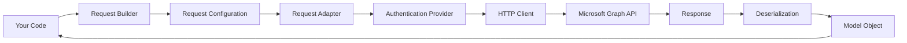

The Microsoft Graph .NET SDK (v5+) is built on the Kiota generation framework and provides a strongly-typed, fluent interface for accessing Microsoft Graph APIs. Understanding its core concepts will help you build robust applications efficiently.

## Architecture Components

The SDK is composed of six major components that work together:

### 1. GraphServiceClient

The main entry point for all Microsoft Graph operations. This client object manages authentication and provides access to all API endpoints through request builders.

```csharp
var graphClient = new GraphServiceClient(tokenCredential, scopes);
```

### 2. Authentication Provider

Handles authentication and token acquisition. The SDK supports Azure.Identity `TokenCredential` implementations, allowing flexible authentication strategies.

### 3. Request Adapter

Manages HTTP communication, serialization, and middleware processing. Built on Kiota abstractions, it handles request/response transformation.

### 4. Request Builders

Provide fluent, strongly-typed navigation through the Microsoft Graph API structure. Request builders mirror the REST API path structure.

```csharp
var user = await graphClient.Me.GetAsync();
var messages = await graphClient.Me.Messages.GetAsync();
```

### 5. Request Objects

Represent individual HTTP operations (GET, POST, PATCH, DELETE) with configurable options like query parameters and headers.

### 6. Model Classes

Property bag objects for serialization/deserialization of Microsoft Graph resources. These are auto-generated from the Graph API metadata.

## Key Design Principles

### Fluent API Design

The SDK uses a fluent interface that mirrors the Microsoft Graph REST API structure:

<CodeGroup>
```csharp REST API Pattern
// GET /me/calendar
GET https://graph.microsoft.com/v1.0/me/calendar
```

```csharp SDK Pattern
// Maps directly to the REST endpoint
var calendar = await graphClient.Me.Calendar.GetAsync();
```
</CodeGroup>

### Extensibility

Most components can be replaced with custom implementations:

- Custom authentication providers
- Custom HTTP clients with middleware
- Custom request adapters
- Extension of model classes

### Type Safety

Strong typing throughout the SDK helps catch errors at compile time:

```csharp
// Strongly-typed query parameters
var users = await graphClient.Users.GetAsync(config =>
{
    config.QueryParameters.Select = new[] { "displayName", "mail" };
    config.QueryParameters.Top = 10;
});
```

## Request Flow

Understanding how a request flows through the SDK helps with debugging and customization:



1. **Request Building**: Start with `GraphServiceClient` and chain request builders
2. **Configuration**: Apply query parameters, headers, and options
3. **Authentication**: Request adapter invokes authentication provider for tokens
4. **Execution**: HTTP request sent with proper headers and serialized body
5. **Response Handling**: Deserialize JSON to strongly-typed model objects
6. **Error Handling**: Errors throw `ODataError` exceptions

## Getting Started

To use the SDK effectively, you'll need to understand:

<CardGroup cols={2}>
  <Card title="Authentication" icon="key" href="/core-concepts/authentication">
    Learn how to authenticate and configure credentials
  </Card>
  
  <Card title="GraphServiceClient" icon="circle-nodes" href="/core-concepts/graph-service-client">
    Explore client initialization and configuration
  </Card>
  
  <Card title="Request Builders" icon="wrench" href="/core-concepts/request-builders">
    Navigate the API using request builders
  </Card>
  
  <Card title="Query Parameters" icon="filter" href="/core-concepts/query-parameters">
    Filter, select, and customize your queries
  </Card>
</CardGroup>

## Version Information

This documentation covers **Microsoft Graph .NET SDK v5+**, which uses the Kiota generation framework. Key differences from v4:

- Built on Kiota abstractions instead of custom HTTP providers
- Direct support for Azure.Identity `TokenCredential`
- Simplified authentication with no separate auth library needed
- Request configuration pattern instead of request options
- `ODataError` exceptions instead of `ServiceException`

## Best Practices

<AccordionGroup>
  <Accordion title="Use async/await consistently">
    All SDK methods are asynchronous. Always use `await` and handle `Task` properly to avoid deadlocks.
    
    ```csharp
    // Good
    var user = await graphClient.Me.GetAsync();
    
    // Avoid - can cause deadlocks
    var user = graphClient.Me.GetAsync().Result;
    ```
  </Accordion>
  
  <Accordion title="Handle errors with try-catch">
    Always wrap SDK calls in try-catch blocks to handle `ODataError` exceptions gracefully.
    
    ```csharp
    try
    {
        var user = await graphClient.Me.GetAsync();
    }
    catch (ODataError ex)
    {
        Console.WriteLine($"Error: {ex.Error?.Code} - {ex.Error?.Message}");
    }
    ```
  </Accordion>
  
  <Accordion title="Reuse GraphServiceClient instances">
    The client is designed to be long-lived and thread-safe. Create one instance and reuse it throughout your application.
  </Accordion>
  
  <Accordion title="Use query parameters to reduce payload">
    Select only the properties you need to minimize response size and improve performance.
    
    ```csharp
    var user = await graphClient.Me.GetAsync(config =>
        config.QueryParameters.Select = new[] { "displayName", "mail" });
    ```
  </Accordion>
</AccordionGroup>

## Next Steps

<Steps>
  <Step title="Learn Authentication">
    Start with [Authentication](/core-concepts/authentication) to understand how to set up credentials and scopes.
  </Step>
  
  <Step title="Initialize the Client">
    Learn how to create and configure a [GraphServiceClient](/core-concepts/graph-service-client) instance.
  </Step>
  
  <Step title="Make Your First Request">
    Use [Request Builders](/core-concepts/request-builders) to navigate and call the API.
  </Step>
</Steps>

## Additional Resources

- [Microsoft Graph REST API Documentation](https://learn.microsoft.com/graph/api/overview)
- [Kiota Documentation](https://learn.microsoft.com/openapi/kiota/overview)
- [Azure Identity Library](https://learn.microsoft.com/dotnet/api/azure.identity)